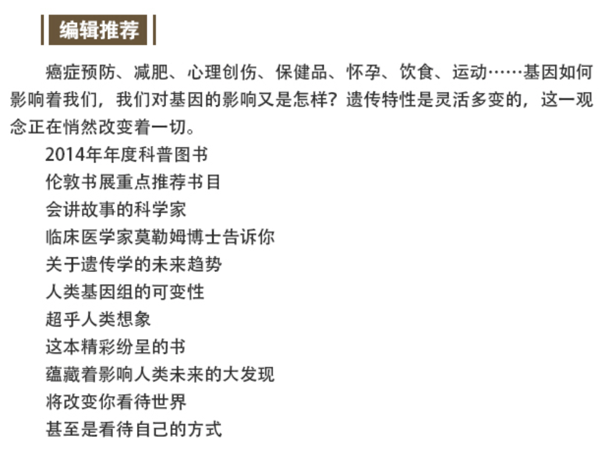
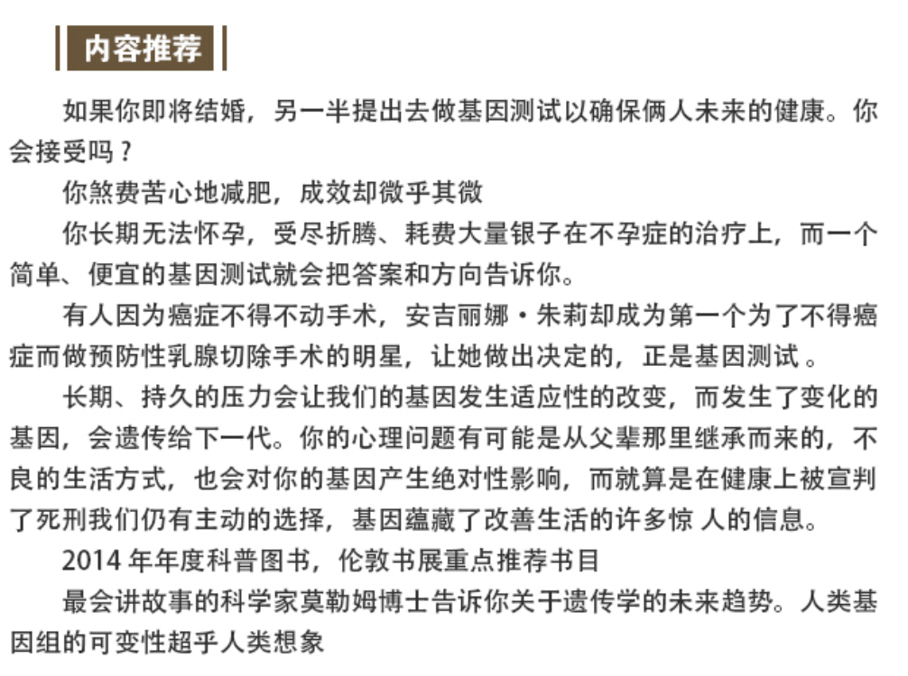

# 基因革命

## 读后感
	
之前以为我们的基因是父母延续下来的，所以应该短期内是不会变的。但当你看完这本基因专家写的书之后，你会发现我们今天所做的事，吃的东西，经历的遭遇都有可能会改变我们基因的链条。而且，还可以遗传下去。很多疾病的引起和治愈也与基因有着密不可分的关系。未来的医学一定是基因层面的，我们今天能做的，是可以先做一个基因测序，对自己更进一步的了解。

##### 遗传学家的思维方式

对别人有效的健康食谱几乎要了杰夫的命。因为杰夫有遗传性果糖不耐受症，他像别人一样一天一个苹果，就会很快去见上帝。没有一个人的基因是一样的，所以基本上不存在对每个人都适用的健康方案。
遗传学家可以通过仔细观察你的面容、手纹、皮肤，就可以知道很多关于你基因的事情。眶踞增宽症或者眼距过窄与400多种遗传病有关联。比如前脑无裂畸形、癫痫和智障。眼裂大幅上倾可能是唐氏综合症的表现。眼裂下倾如果加上平足和下颚短小，就会导致心脏病和寿命缩短。虹膜异色与头发颜色浅淡配在一起可能是瓦登伯格氏综合征。双重睫毛的人与基因突变有关，伊丽莎白泰勒就是。作者在和妻子结婚五年后才发现妻子是双重睫毛。他觉得最可开发的地方就是人的面部。
如果你人中线不明显，眼睛有点小，还有朝天鼻，那么你母亲很有可能在怀孕期间喝过酒。遗传学家关注的是你的身体每一个部位、每一个裂缝、每一个秘密。这里有你基因的秘密。

##### 基因不仅仅是显性隐形那么简单

7042号捐精者拉尔夫长得很帅，是个来自丹麦的金发壮男。他成为了25个孩子的爸爸。那些选择了7042号的家庭发现孩子们都出现了松弛的皮囊、面部缺陷和神经性纤维瘤。这导致丹麦修改了捐精的法律。为什么基因在拉尔夫身上没有任何表现，但在孩子们身上都展示出来了呢？
因为基因并不以二元的方式来回应我们的生命。研究豌豆的孟德尔没有发现的是一个叫做变异基因表达度的指标。即使我们继承的基因是确定的，他们却能以任何形式来表达自己。你的行为能够控制你的基因命运。基因所表达的灵活性是超过我们想象的。比如宇航员在国际空间站工作一段时间之后，心脏就会比原来缩小1/4。你不需要去太空，只要在床上躺几周，身体就会开始萎缩。而当你恢复锻炼，基因又会指挥细胞快速恢复。这与我们已知的基因理论是相反的，我们的基因并不是一成不变的，而是能适应生命中不断变化的需求。

##### 什么在改变我们的基因？

蜂后和工蜂的体型差异巨大，它的螫针可以重复使用，生命长达数年，工蜂只有几个星期。但是从遗传学的角度，蜂后没有任何特别之处，它和其它雌性工蜂来自同一父母，有着完全相同的DNA。它变得与众不同的唯一原因仅仅是因为它吃得更好。蜂群在决定选择蜂后时会选出一些幼虫，把它们泡在蜂王浆中。最后它杀掉其它姐妹成为蜂后。吃大量的蜂王浆是为了关闭成为工蜂的基因Dnmt3。同样的道理，菠菜中的甜菜碱能够将结肠肿瘤发病率降低一半，也是因为它抵御了肉制品当中的致癌基因突变。
    我们吞下的药片、吸入的香烟、喝下的酒精、参加的锻炼和受过的X射线都可以导致表观遗传变异，压力也可以。人们把小老鼠每天从鼠妈妈身边拿走三小时，这样的压力导致这些老鼠长大之后总是无法适应环境。并且这种症状会遗传给下一代。尽管下一代并没有被虐待。
经历过校园暴力或者911这样的巨大压力的人，很多都出现了身体和基因的变化，而且对后代都有影响。

##### 基因与骨骼

我们的骨骼时时刻刻都在重建，破骨细胞和成骨细胞交替工作。差不多十年，我们的骨骼会完全更新一次。即使你的基因毫无问题，但闲置不用、衰老、不良饮食和激素变化都会摧毁骨骼结构的微妙平衡。基因突变对骨骼的影响很大。200万人中会有一个石人症，就是细胞把肌肉变成骨骼。石人症的大脚趾可能很短，他们的基因使得成骨细胞一直工作，肆无忌惮的把所有细胞变成骨头。最有名的案例是一个费城人，他5岁开始变硬，39岁去世时只有嘴唇能动。而当基因抑制了胶原的产生或者胶原质量较差时，就会出现OI，成骨不全症，又称脆骨症。这些患者眼白发蓝，牙齿半透明。只是因为基因序列上的一个字母缺失，就会导致胶原产生出现问题。从而导致上述疾病。

##### 基因与饮食

我们的身体对大多数种类的食物能够接纳，但也会有少数食物与你的基因构成无法相容。很可能你的身体不喜欢某些食物，而你并不知道为什么。对于多数亚洲人来说，牛奶和乳制品很难消化。除非你的祖先饲养牛羊以产奶，这很可能使他们的基因发生突变。普遍的建议是像你的现代祖先那样吃东西，但不要吃那么多，多做运动，观察自己的身体，找到蛛丝马迹来证明做的对不对。对个体而言，泛泛的饮食建议可能并不适用。这不仅因为每个人的遗传基因不同，更重要的是，你吃的东西会改变你的基因。
所以你最好做一下基因测序，你会知道你能不能喝咖啡，能不能喝酒，应该吃肉还是吃素。烟草由于含有有毒物质，所以可以打开用来解毒的CYP1A2基因，所以抽烟的人喝咖啡容易吸收咖啡因。绿茶中的化学成分可以促使癌细胞死亡，未死亡的癌细胞增长速度也慢了很多。除了基因之外，你体内的菌群也决定着你的健康状况。科学家给实验的老鼠注射了胖子大肠里的菌群，然后给它们吃麦当劳，这些老鼠毫无意外地变胖了。但是，那些没有注射菌群的对照组，吃着同样的麦当劳，却丝毫没有胖。结论是，肥胖是可以传染的。但医学界对于菌群健康的关注还不如对基因的关注，目前没有特别的建议。只是不要乱用抗生素。

##### 基因与用药安全

每年都会有大量用药事故，但未必是医生开错了药，而是用药的人基因与众不同。有个叫梅根的女孩，有三个CYP2D6基因，普通人有两个。医生给了她正常剂量的可待因镇痛剂，在她体内迅速转化为吗啡，导致其死亡。大概10%欧洲血统和30%北非血统的人都会超速代谢某些药物。服用鱼油对有些人种有效，对有些人种会有害。所以，服药之前检查一下基因组会更有帮助。

##### 基因与左撇子

左利手的女性患乳腺癌的概率是右利手女性的两倍以上。早产儿是左撇子的概率是一般人的两倍。左撇子还和阅读障碍、精神分裂、注意力缺陷多动症有关联。孕妇饮酒会导致胎儿纤毛出现异常，从而导致内脏器官错位，在体内相反的方向生长。
基因帮助我们确定了偏侧性，生命和大脑的正常发育都依赖这种平衡。如果相关基因不能恰当的行使其功能，我们整个身体都会处于混乱之中。

##### 我们都可以是X战警

作者在攀登富士山的时候充满痛苦，而一个90岁的老妇人竟然帮助了他。还给他灿烂的笑容。原因是作者比大多数人都更容易产生高原反应。而夏尔巴人在爬山方面的特异能力也来自于他们的基因。而有一些运动员天生就拥有比常人高的学氧含量。他们不需要注射人工合成EPO（像阿姆斯特朗那样），就能够获得很多奖牌。夏尔巴人正好相反，他们的基因变异抑制红细胞的数量，也就是弱化EPO的生成。他们没有增加红细胞数量，而是创造了一种供氧的稳定性。夏尔巴人的进化是人类发现的环境对人进化影响最快的案例。而当人的SCN9A基因发生突变时，会出现痛觉不敏感症。这些孩子一般长不大，因为他们不知道防范风险。有一个女孩出生后不久就开始伤害自己，把自己的舌头都嚼烂了，也戳瞎了自己的右眼。医生为了保护她拔掉了所有的牙齿，还把另一只眼睛缝了起来。一个巴基斯坦男孩也是如此，他在街头表演用尖锐的东西插入自己的身体。14岁时，为了给朋友一个惊喜，从楼顶跳下来死了。
有时候你距离X战警，就只有一个基因字母的距离。

##### 基因应该成为隐私吗？

你的单位、烟草公司、保险公司、政府，都希望知道你的基因，以决定是否接受你的保险或者雇用你。最直接的是你的新郎可能会在结婚前拿着你的头发去做基因检测，以决定要不要和你结婚。万一你的基因中有什么致命的问题呢？安吉丽娜朱莉目睹了母亲因为乳腺癌去世，并查出自己基因上也有突变，这意味着她有65%的可能罹患乳腺癌。她决定摘除了双侧乳腺。
在日常生活中要学会保护我们的基因。航空旅行时受到的辐射、日光浴时的紫外线、鸡尾酒里的乙醇、二手烟中的化学残留、杀虫剂，都会损害你的DNA。我们不仅要审视家族病史，解码自己的基因，还要琢磨如何做出积极的改善。有的人需要摘除乳腺，有的人要禁食水果。今后会有更多人关注你的基因，不仅是你自己。这是一个趋势。

##### 基因与性别模糊者

我们都以为性别是由X和Y染色体决定的。但当一个人的X染色体上多了一个SOX3基因的拷贝时，就可以使一个女孩发育成男孩，不管有没有Y染色体。这个基因的变化让女性长得特别男性化。泰国大概有20万变性人，最著名的拳王芭利娅就是变性人，他参加拳赛是为了攒钱做变性手术。他会化妆参加比赛，把对方打到之后再给他一个吻。变性人即便做了全部的手术，也会被行家识破。问题出在手肘上，男女的外偏角是不同的。不符合男女严格气质的还有阉割人，他们普遍寿命更长，比皇宫里的其他人多活几十年。阉割后他们的基因也发生了变化。
如今，世界上有超过6000种已知的罕见疾病，一共影响了3000多万美国人，超过美国人口的10%。正是这些罕见疾病患者，帮助医生拼凑了基因的全貌，他们每一个人的生命都有着巨大的意义。未来，你有可能不会患上任何癌症，但你必须得莱伦氏综合征。会变成丛林里的小矮人，他们的基因就从来不得癌症。

##### 基因检测目前的应用
1.食物不耐受组合   
2.皮肤基因检测  
3.儿童天赋测评  
4.儿童健康成长检测  
5.超早期肿瘤筛查

